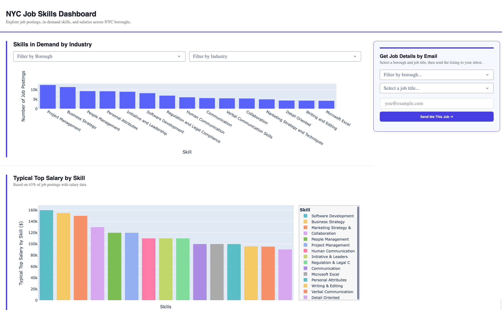

# NYC Job Skills Dashboard

An interactive dashboard exploring job postings, in-demand skills, and salary trends 
across New York City's five boroughs. Built to help job seekers understand where 
opportunities are — we extract and analyze job descriptions using NLP to surface the 
skills employers are actually looking for and delivering **curated job opportunities 
directly to your inbox** via email.

## 📁 Project Structure

```
.
├── assets/
│   └── NYC-Job-Skills-Dashboard.png
├── main.py                     # App entry point; runs the NYC Job Skills dashboard
├── fetch_jobs.py               # Fetches NYC job postings from the Open Data and BlueDoor API
├── process_jobs.py             # Cleans, normalizes and transforms raw job data
├── jobs-processed.parquet      # Processed dataset ready for visualization
├── private-sector-raw.json.gz  # Raw private-sector job postings
├── public-sector-raw.json.gz   # Raw public-sector job postings
└── parquet_schema.txt          # Documents the schema of the processed dataset
```

## 🚀 Preview




## 🛠 Tech Stack

- **Python** — Dash, Plotly, Pandas
- **NLP/ML** — ojd-daps-skills (skill extraction + taxonomy mapping)
- **Data** — NYC Open Data API, BlueDoor API
- **Email** — Resend + Porkbun (custom domain email delivery)
- **Environment** — python-dotenv for config management


## ✨ Features

- Choropleth map of job postings by NYC borough
- Industry × Borough heatmap revealing hiring concentration
- Salary breakdown by skill
- Interactive filters by industry and borough
- Covers both public and private sector job postings
- NLP-powered skill extraction from raw job posting text
- Email delivery of real and live curated job opportunities

## 📊 Data Sources

- [NYC Open Data — Jobs NYC Postings](https://data.cityofnewyork.us/City-Government/NYC-Jobs/kpav-sd4t)
- [BlueDoor](https://bluedoor.sh/apis/job-postings)

## ⚙️ Setup

```bash
git clone https://github.com/ALINATSUI/Project_NYCJobs.git
cd Project_NYCJobs
cp .env.example .env  # add your API token
python main.py
```

## 💻 Usage

Once running, open your browser to `http://localhost:8050`

